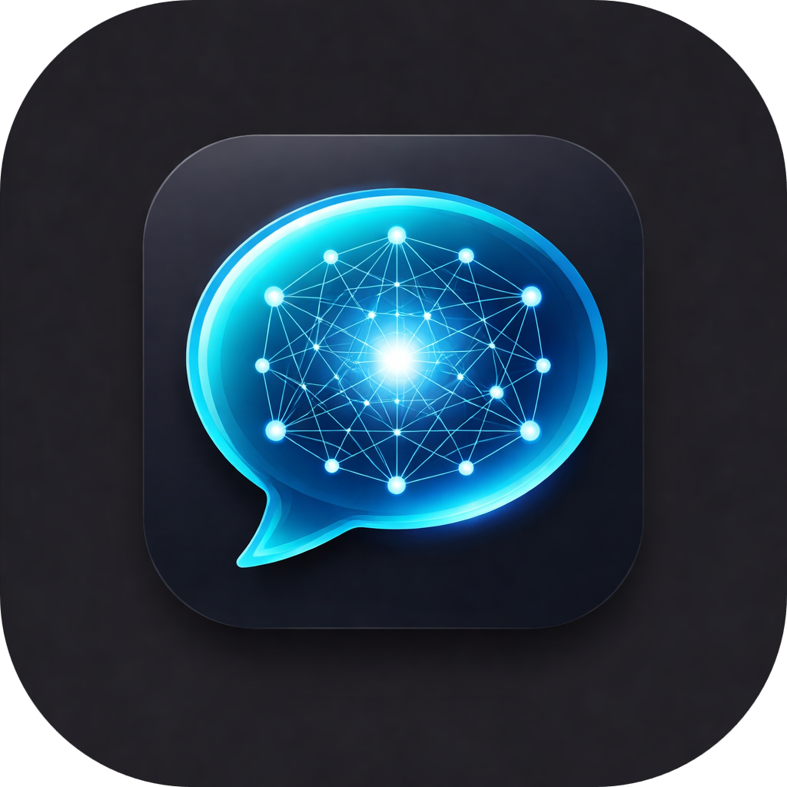
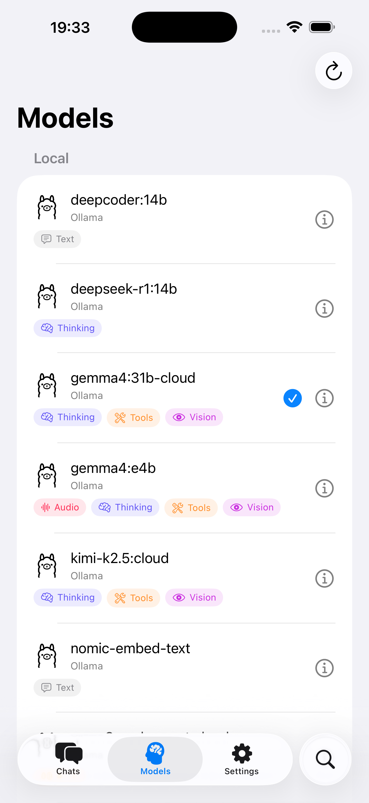
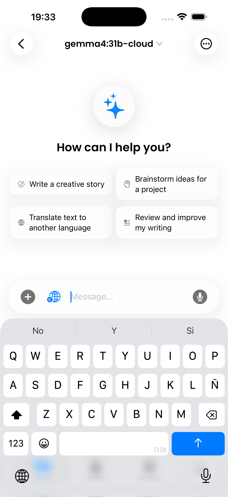
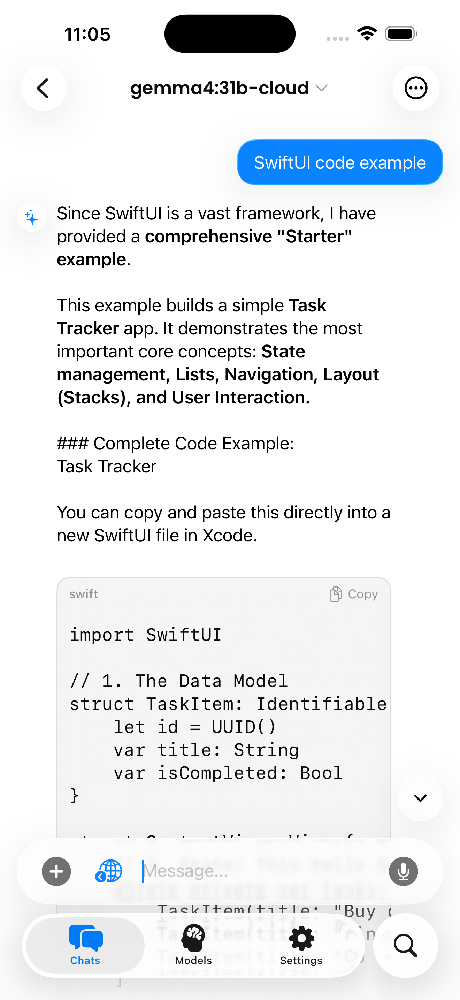
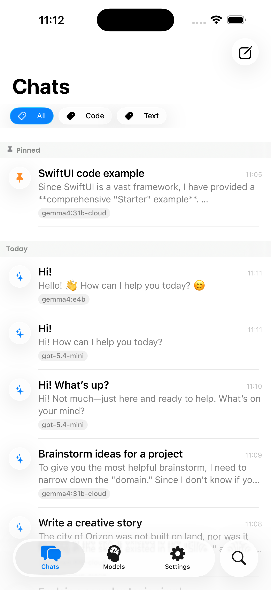

<p align="center">
  
</p>

<h1 align="center">OpenClient</h1>

<p align="center">
  
  
  
  
  
</p>

## Description

OpenClient connects you directly to your own AI server — no subscriptions, no data collection, no third parties.

Works with [LiteLLM](https://github.com/BerriAI/litellm), [Ollama](https://ollama.com), and any OpenAI-compatible server. Point the app at your URL and start chatting with any model: GPT, Claude, Llama, Gemini, Mistral, and hundreds more.

**Chat**
- Real-time streaming responses with Markdown and code block rendering
- Collapsible Thinking block for reasoning models (DeepSeek, o1, Gemini Thinking, and more)
- Attach photos, camera shots, and PDF documents for multimodal conversations
- Dictate messages with Speech-to-Text; have responses read aloud with Text-to-Speech
- Generate images directly from chat
- Web search powered by your server's configured provider (Brave, Firecrawl, and more)
- Agentic tool-calling loop for models that support function calling
- Favourite any message to bookmark it and jump back instantly
- Custom system prompt and model parameters (temperature, max tokens, top-p) per conversation

**Conversations**
- Full conversation history with search, pins, and tags
- Branch from any message to explore alternative responses; edit and regenerate
- Media & Files gallery: browse all attached images and documents in one place
- iCloud sync across all your Apple devices
- Export conversations to JSON
- Token usage per message

**Models**
- Browse all available models with capability badges (vision, tools, JSON mode, image generation...)
- Voice selector for Text-to-Speech models
- Switch models per conversation

**Personalization**
- Prompt template library: save and reuse system prompts for any workflow
- User profile: set your name and context so every model addresses you personally
- Memory: save facts and preferences (manually or let the model save them automatically); injected into every conversation's system prompt and synced via iCloud

**macOS**
- Menu bar companion for instant access without opening the main window

🌐 [Project website](https://www.arturocarreterocalvo.com/openclient-llm/)

[](https://apps.apple.com/us/app/id6761379499)

**macOS:** Download the latest signed and notarized `.dmg` directly from the [Releases](https://github.com/artcc/openclient-llm/releases) page.

## Screenshots

<p align="left">
  &nbsp;&nbsp;
  &nbsp;&nbsp;
  &nbsp;&nbsp;
  
</p>

## Technologies

| Technology | Purpose |
|-----------|---------|
| Swift 6+ | Language |
| SwiftUI | UI Framework |
| Liquid Glass | Design language (iOS 26+) |
| async/await | Concurrency |
| URLSession + SSE | Networking & streaming |
| Keychain | Secure storage |
| SwiftLint | Code linting |
| SF Symbols | Iconography |
| Votice | In-app feedback & feature requests |

This project was developed entirely with Xcode, Visual Studio Code and GitHub Copilot (with Claude Opus / Sonnet 4.6).

## Architecture

The project follows **MVVM + UseCase + Repository + Manager** with Swift strict concurrency and `async/await`. Code is organized by feature under `Shared/`, shared across iOS and macOS targets. Platform-specific UI lives in each target's own folder.

See [ARCHITECTURE.md](ARCHITECTURE.md) for the full project tree and layer responsibilities.

## Usage

1. **Clone** the repository:
   ```bash
   git clone https://github.com/ArtCC/openclient-llm.git
   ```
2. **Open** in Xcode:
   ```bash
   cd openclient-llm
   open openclient-llm.xcodeproj
   ```
3. **Configure** your server URL in the app settings:
   - **LiteLLM**: `http://your-server:4000`
   - **Ollama** (direct): `http://your-server:11434/v1`
4. **Run** on your device or simulator

### Requirements

- Xcode 26+
- iOS 26+ / macOS 26+
- A running [LiteLLM](https://docs.litellm.ai/) server (local or remote), **or** a running [Ollama](https://ollama.com) instance (v0.1.24+ for OpenAI-compatible `/v1` endpoint)

### Self-hosting guides

If you need to set up the backend on your own server, these guides cover Docker Compose configurations, reference `.env` files, and common operational commands:

- [Ollama.md](Ollama.md) — Run Ollama with Docker (CPU and NVIDIA GPU)
- [LiteLLM.md](LiteLLM.md) — Run LiteLLM with Docker (Postgres, Traefik, local + cloud models)

## License

This project is licensed under the [Apache License 2.0](LICENSE).

## Contributing

Contributions are welcome. Please read [CONTRIBUTING.md](CONTRIBUTING.md) for guidelines on how to report issues, propose features, and submit pull requests.

You can also suggest features and report bugs directly from within the app — go to **Settings** and use the built-in feedback option powered by [Votice](https://github.com/ArtCC/votice-sdk), another open source project by the same author.

## Author

**Arturo Carretero Calvo**

- [GitHub Profile](https://github.com/ArtCC)

## Your AI. Your server. Your rules

<p align="left">
  OpenClient is built on the belief that generative AI should be something you control — not something that controls your data.<br/>
  Run local models entirely on your own hardware, or route cloud providers through your own self-hosted proxy.<br/>
  Either way, you decide what gets sent where — no vendor lock-in, no platform middleman, no data you didn't choose to share.<br/><br/>
  Open source. No tracking. Full control.
</p>